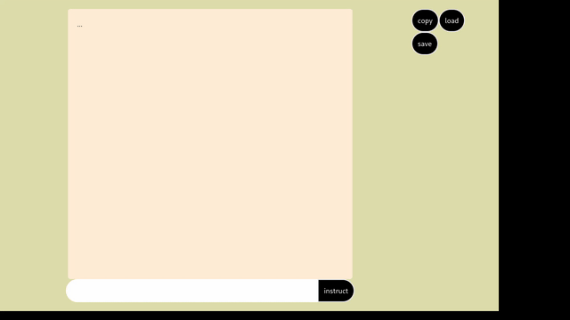

# Voxdocs



## Summary

This app was created as a simple example of building a UI utlizing OpenAI's APIs for data transforms.

## Setup

To use nix, make sure you have nix and devenv installed (and optionally direnv)

### Install dependencies

#### w/ Nix

This project is setup to use [`devenv`](https://devenv.sh) to manage a development environment, including dependencies, process management, and in the future testing.
Assuming you have nix, devenv, and direnv installed, you need to `cd` into the root of the repo, then run `direnv allow` to install all of the dependencies used in the repo (or `devenv shell` if you aren't using direnv).

#### w/o Nix

#### Install Dependencies

**Base dependencies:**

- javascript/npm

**Libraries:**

- `npm install`

### Create .env file

Please add a `.env` file to the root of the repo based on the `.env.example` file.

## Usage

### w/ Nix

In the root of the repo run `devenv up` to start the server.

### w/o Nix

#### 1. Start everything up

Run `npm run dev`

## Deployment

Login:

```
flyctl auth login
```

Create an app:

```
flyctl apps create voxdocs
```

Allocate ipv4:

```
flyctl ips allocate-v4
```

Copy the container to fly.io registry:

```
devenv container processes --copy
```

Create a volume for `devenv` state:

```
fly volumes create devenv_state --region ams --size 1
```

Deploy your app:

```
flyctl deploy
```

## Todo

- [ ] look into eslint changes in original vite output `README.md`
- [ ] add tests
- [ ] add CI/CD
- [ ] add monitoring/logs
- [ ] responsive for mobile usage
- [ ] interactive checkboxes
- [ ] production deployment
- [ ] settings panel
- [ ] voice output (messages only)
- [ ] voice input
- [ ] user ability to store api key in local session and make requests from client avoiding the need for a deployed backend (?)
- [ ] mobile app version (?)
- [ ] history (?)
